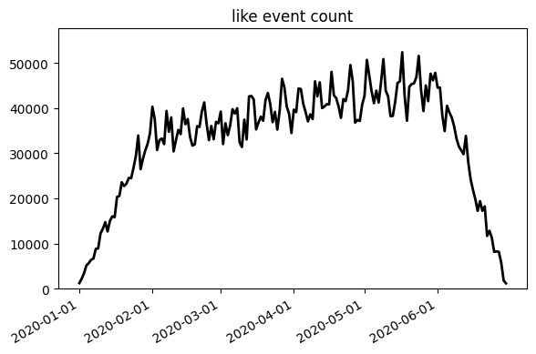
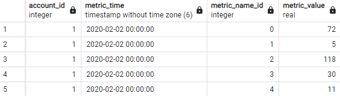
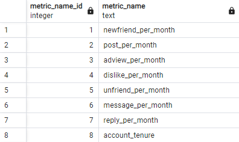
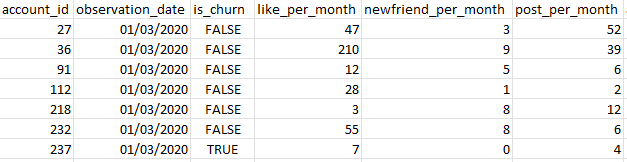
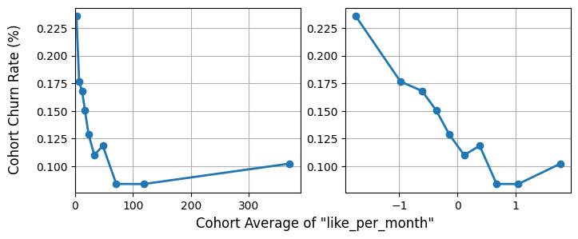
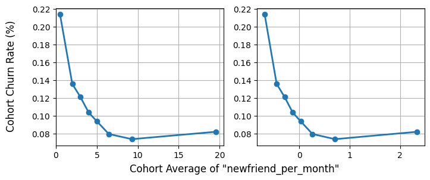
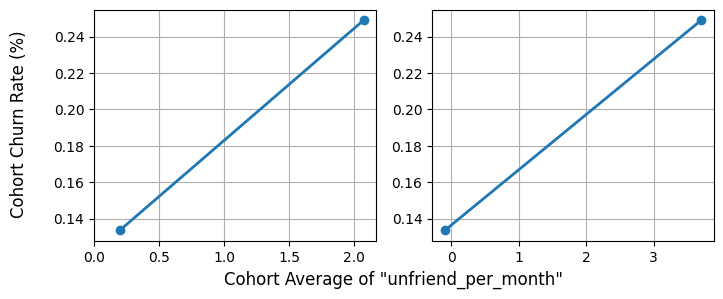
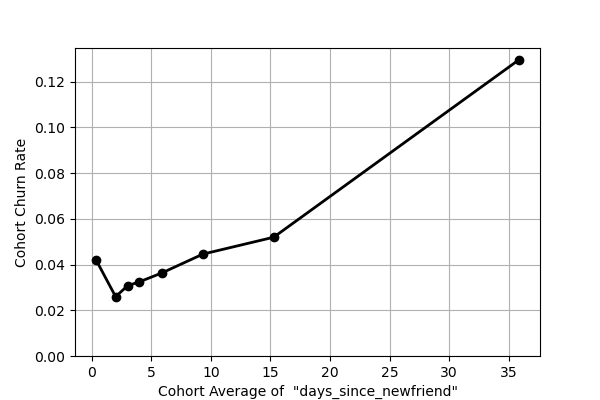
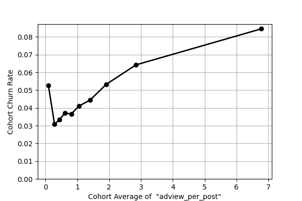
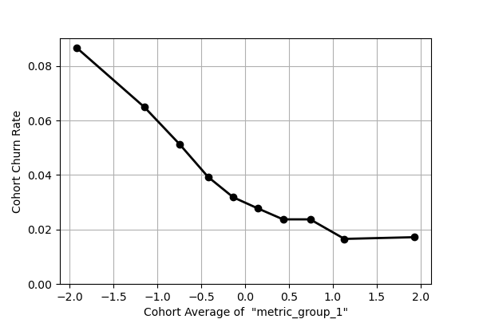

# Fighting Churn with Data

This project demonstrates how the usage and subsciption data or a product or service can be combined to identify user behaviours which predict customer churn. This analysis can then be used to develop customer retention strategies.

The SQL and python scripts included in this repo are intended to be used on the simulated social network 'SocialNet7' dataset which can be generated by running the setup of [fight-churn](https://www.manning.com/books/fighting-churn-with-data) for the book [Fighting Churn with Data](https://www.manning.com/books/fighting-churn-with-data) by Carl Gold. 

The SQL scripts and Python notebooks of this project follow the natural order of any effort to combat churn. They should be followed and executed in order. Any intermediate outputs are held in the [output](./output/) folder.

### Part 1 

Focuses on setting up the metrics used for churn analysis.

- [churn-calculations](./part1/churn-calculations/) includes SQL scripts for calculating:
    - activity event based churn
    - MRR churn
    - net retention
    - standard account-based churn
- [insert-metrics](./part1/insert-metrics/) includes a SQL script for inserting aggregated metrics for each kind of analytics event.
- [event-quality-assurance](./part1/event-quality-assurance/) contains a notebook and SQL scripts for plotting events over time.
- [metric-quality-assurance](./part1/metric-quality-assurance/) contains a notebook and SQL scripts for spotting anomalous metric values which might indicate problems with event collection.
- [account-tenure](./part1/account-tenure/) contains scripts for calculating account tenure (the length of time for which there is a continuous subscription for a single account) and inserting this into the data warehouse as its own metric.
- [identify-active-periods](./part1/identify-active-periods/) contains SQL scripts for calculating the active periods (allowing for a maximum 7 day gap between subscriptions) and inserting these into an `active_period` table. These are used to determine whether or not a metric observation ended in churn.
- [create-churn-dataset](./part1/create-churn-dataset/) is where the the fun begins! Here, we create a dataset of 'per-month' event metric observations which form the basis of our churn analysis.

### Part 2 

Focuses on cohort analysis and clustering metrics into groups of behaviours. These metrics and groups could then be used by the business to target interventions to stop people from churning from the product.

- [metric-summary-stats](./part2/metric-summary-stats/) contains a notebook for checking summary statistics for all metrics (so that we can check the percentage of zero-values).
- [metric-scores](./part2/metric-scores/) contains a notebook for producing normalised ("scored") versions of each event metric.
- [metric-cohorts](./part2/metric-cohorts/) contains notebooks for performing cohort analysis on inidividual and grouped versions of our metrics.
- [metric-correlations](./part2/metric-correlations/) contains a notebook for calculating and visualising the matrix of Pearson correlation coefficients between metrics.
- [group-behavioural-metrics](./part2/group-behavioural-metrics/) contains notebooks for:
    - grouping metrics together using hierarchical clustering (using SciPy's `linkage` and `fcluster`) and generating a loading matrix for averaging together the scores of those groups
    - applying the loading matrix to create grouped scores.

### Part 3 

Focuses on forecasting churn probability with logistic regression.

- [train-model](./part3/train-model/) contains notebooks for:
    - training the logistic regression model.
    - showing the impact of each model parameter (grouped or individual behaviour) on the likelihood of retention/churn, and checking model calibration.
- [forecast-churn](./part3/forecast-churn/) contains a notebook and SQL script for creating a revised version of the metric dataset which contains current customers only, ready for forecasting.

The subscription data, analytics data and the churn metrics produced from them are stored locally in a PostgreSQL database.

### About the model and dataset

The simulated product is a simple social network. Eight kinds of analytics events are measured:

| Events  |            |
|---------|------------|
| AdView  | New friend |
| Dislike | Post       |
| Like    | Reply      |
| Message | Unfriend   |

The simulation is designed so that there are realistic relationships between the occurrence of these events and the customers’ simulated churn and renewal. These events, along with customer subscription information, are stored locally in a Postgres data warehouse.

The simulation consists of 15,000 customers over a period of 6 months from 01/01/2020 onwards. The total count for each event type over time follows a similar pattern:

### Creating the metrics

We insert into the data warehouse a table of measurements. For each customer, for each event type, we count the number of times that event occurred in the last 28 days. We make these measurements every 7 days. The metric table looks like this:

where metric names are:

By checking how the maximum, average, minimum and total number of events of each type varies over time, we can be confident that there aren't any gaps in our events:

We also add a metric for _account tenure_, defined as the length of time a customer uses the product
their current, uninterrupted period of activity, allow for a short gap of _31 days_.

### The churn dataset

The churn dataset is a set of customer observations which tell us the number of each event type which occured over the 28 days prior to the observation, along with an indicator of whether or not that observation occurred immediately before that customer churned.  

We can create this dataset by working out which customer active periods did or didn't end in churn. An _active period_ is defined as a period of time when an account is continuously subscribed through one or more individual subscriptions. We allow for a maximum gap of 7 days between subscriptions in this model.

By knowing which active periods for customers did or did not end in churn, we know which metric observations did or did not end in churn, and can create a churn dataset like this:

### Clustering metrics and performing cohort analysis

If we suppose that people using the product a lot are less likely to churn than people who are using the product a little or not at all, then a cohort analysis of churn that uses common behaviours from the cohorts lets us test that hypothesis. If we divide our customers into quantile-based cohorts based on their level of activity for a particular behaviour, if an activity is related to lower churn, we should find that the churn rate on the most active group is the lowest.

We can see that for behaviours which we intuitively associate with engagement with the service, such as _liking posts_ and _making new friends_, more active cohorts have _lower_ churn rates (on the left we see the raw cohort averages, and on the right, we see standard-deviation-based scores centered on the mean):

Whereas for the negative behaviour of _unfriending_, more active cohorts have a _higher_ churn rate:

Perhaps most interesting are some of the rate-based or time-based metrics which can be produce from the base metrics:

Based on these relationships and further investigation, the business may decide to create interventions which encourage users to make friends more often, or consider balancing the number of ads that users see.

Although the number event types in our simulation is small, for real products and services, it can be benefitial to group certain event types together into behaviours in order to prevent information overload and discover clearer relationships with churn than individual event types might exhibit. 

We can discover groups of correlated metrics perform hierarchical clustering of metrics using SciPy's `linkage` and `fcluster`. Running this clustering algorithm on an expanded set of metrics gives us these groups:

| Group:         | Descriptive name:          | Metrics:                                                                                |
|----------------|----------------------------|-----------------------------------------------------------------------------------------|
| metric_group_1 | Posting and making friends | adview_per_month\|like_per_month\|newfriend_per_month\|post_per_message\|post_per_month |
| metric_group_2 | Unfriending                | unfriend_per_month\|unfriend_per_newfriend                                              |
| metric_group_3 | Messaging                  | message_per_month\|reply_per_month                                                      |
|                | Dislikes per month         | dislike_per_month                                                                       |
|                | Seeing lots of ads         | adview_per_post                                                                         |
|                | reply_per_message          | reply_per_message                                                                       |
|                | More dislikes than likes   | dislike_pcnt                                                                            |
|                | Increase in new friends    | newfriend_pcnt_chng                                                                     |
|                | Time since new friend      | days_since_newfriend                                                                    |

We can see that the algorithm groups some metrics into intuitive behaviours, such as posting and making friends, unfriending, and using the platform's messaging features. We can see from the cohort analysis of this first group that the highest scoring cohort has 1/4 of the churn rate of the lowest scoring cohort:

### Future work

Some ways in which this project could be expanded are:

- Measure the accuracy of the forecasts using area-under-the-curve and lift.
- Create churn cohorts with demographic and firmographic categories to see which _kinds_ of customers tend to be more engaged.